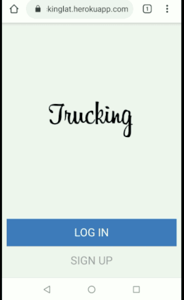
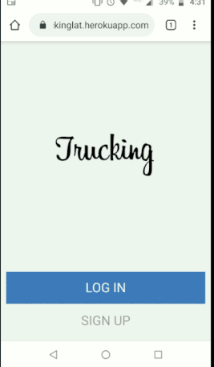
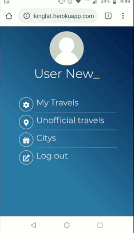

(Truking)Kilometers-per-truck
==============

Microverse ROR Capstone Project based on an app for grouping kilometers by cities on mobile. 

The app is designed for an enterprise in the field of delivering that needs to measure how many kilometers do each of its trucks register for every service they do to a given city and for every extra kilometers not destined to work (go to lunch - fuel load - truck service - others)

### Prerequisites

- Ruby: 2.6.5
- Rails: 5.2.4
- Postgres: >=9.5

## Live Version
Trucking: [https://truckinglat.herokuapp.com/](https://truckinglat.herokuapp.com/)

## What it does?
As a user once you registered are able to do the following:

- Register multiple travels you've made (per service)
  * specify the package to deliver
  * the kilometers traveled
  * the destiny (city) if it's an offical travel
- See all the travels you've made in your profile
  * view the official & unofficial travels separately (unofficial does not have destiny)
- View available citys for destiny and register a new one if required

  
## Configuration

### Step 1: Clone and install dependencies
Clone the repo and run `bundle install` to get all the gems on your terminal.
### Step 2: Run database migration
From terminal type `rails db:migrate` to get your schema updated
### Step 3: Work on IRB
That's it on configuration. Now you can just open your terminal to start on `rails server` and open your browser

### Step 4: View your app
Now you can navigate to `localhost:3000` on your browser to see your app working.
Feel free to create as many travels as required. If you want to record an official travel you will have to go first to register a city if there is no one.

## Business Rules

 [You can find original business rules here](Bussiness-Rules.txt)

## 🤝 Contributing

Contributions are more than welcome! Feel free to check [issues page](https://github.com/ricardovaltierra/private-events/issues).

1. Fork (https://github.com/ricardovaltierra/kilometers-per-truck/issues)
2. Create your working branch (git checkout -b [branch_name])
3. Commit your changes (git commit -am 'what you will add or fix or improve')
4. Push (git push origin [branch_name])
5. Create a PR

## 🤖 Contributor

Ricardo Valtierra - [GitHub](https://github.com/ricardovaltierra)

## 🙋‍♂ Support :)

Give a ⭐️ if you liked it!

## 📝 License

This project is under the [MIT](LICENSE) license.

## Creative Commons

Shield: [![CC BY-SA 4.0][cc-by-sa-shield]][cc-by-sa]

This work is licensed under a [Creative Commons Attribution-ShareAlike 4.0
International License][cc-by-sa].

[![CC BY-SA 4.0][cc-by-sa-image]][cc-by-sa]

[cc-by-sa]: http://creativecommons.org/licenses/by-sa/4.0/
[cc-by-sa-image]: https://licensebuttons.net/l/by-sa/4.0/88x31.png
[cc-by-sa-shield]: https://img.shields.io/badge/License-CC%20BY--SA%204.0-lightgrey.svg